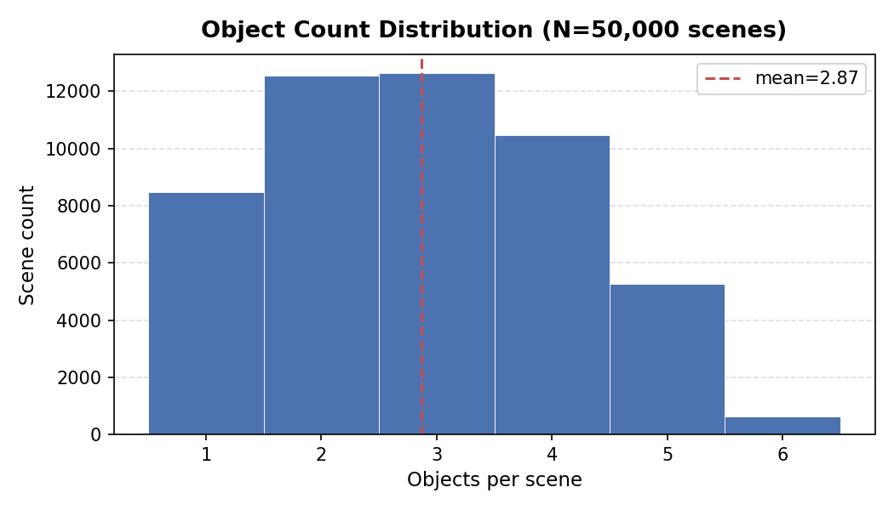
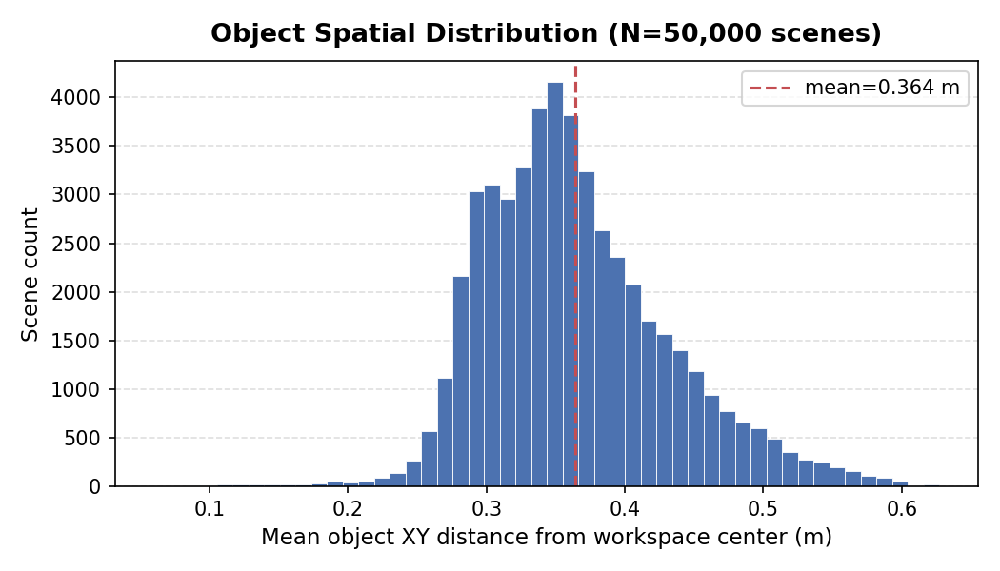
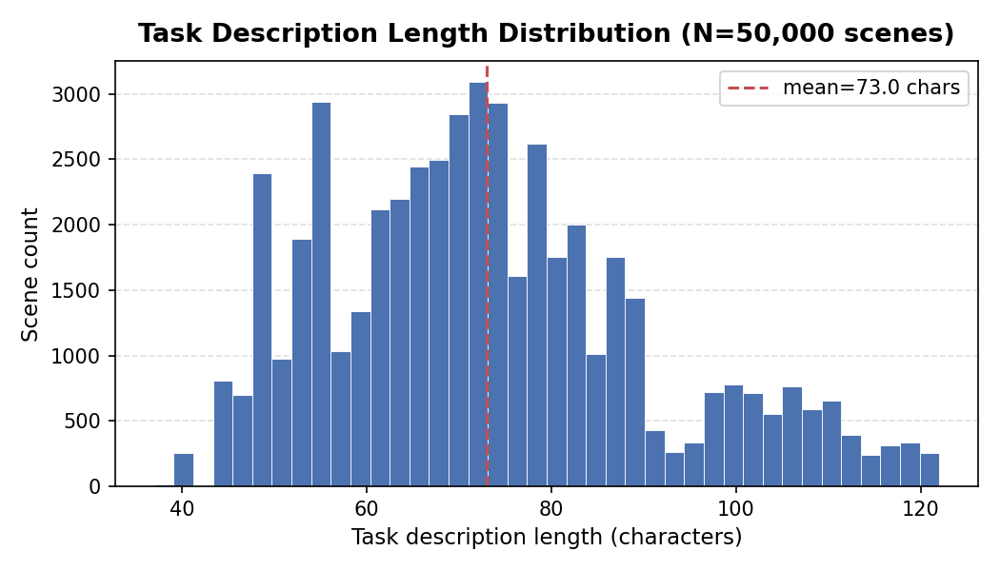

# Demiurge Dataset v1 Card

**Version:** 1
**Generation dates:** 2026-05-12 to 2026-05-13
**Git SHA at generation:** `146699b`
**Status:** Complete

---

## Summary

50,000 physically validated tabletop manipulation scenes for a UR5e robot arm,
generated by the Demiurge procedural sampler and validated by the Drake
simulator. Each scene passes four checks: non-interpenetration, static
stability, IK reachability, and collision-free BiRRT solvability.

---

## Dataset Statistics

### Accepted Scene Counts

| Template | Accepted | Attempts (resume run) | Acceptance rate |
|---|---|---|---|
| tabletop_reach | 20,318 | 167,221 | 12.2% |
| cluttered_pick | 8,164 | 124,897 | 6.5% |
| obstacle_avoidance | 15,921 | 125,307 | 12.7% |
| **Total** | **50,000** | **417,425** | **10.6%** |

> **Note on attempt totals.** Production data spans two runs: an initial
> 5,597-scene run terminated by OOM (attempt count not preserved in logs) and
> a resume run that completed the remaining 44,403 scenes from 417,425
> attempts. Cumulative attempt count across both runs is not exactly known;
> extrapolating from the resume run's 10.6% acceptance rate suggests
> approximately 52,800 total attempts for the initial run, giving a combined
> estimate of roughly 470,000 total attempts.

### Acceptance Gate Override

All three templates fall below the 20% acceptance gate defined in the
implementation plan. This gate is deliberately overridden for the following
documented reasons:

- The cluttered_pick floor at 6.5% is a load-bearing property of the dataset.
  Dense object placement is the design intent of that template. Tuning
  parameters to raise acceptance would reduce scene difficulty and collapse
  the difficulty stratification that Week 5 evaluation depends on.
- The 12-vocab numbers are structurally consistent with the 8-vocab Week 2
  baseline (8.1% / 18.5% / 12.7%). The gate was calibrated to catch
  catastrophic regression (e.g., the 16-vocab cluttered_pick collapse to
  0.7%), not to exclude templates that are hard by design.

Gate override approved by Galanafai on 2026-05-12. Full decision record in
`artifacts/validator_profile.md`.

---

## Per-Check Rejection Rates (Profile Estimate)

The production log captures per-template totals only; per-check breakdown is
from a 500-scene profile run at the same RRT budget (2s) and vocabulary
(12-object set). Production results should be expected to track these rates
within approximately 2 percentage points.

| Validator check | Pass rate | First-fail count (500 attempts) |
|---|---|---|
| no_interpenetration | 97.2% | 14 |
| stable_rest | 97.2% | 0 |
| ik_reachable | 82.4% | 74 |
| rrt_solvable | 10.2% | 361 |

The RRT check is the dominant bottleneck, accounting for the large majority of
rejections. This is expected: the BiRRT must find a collision-free path through
a cluttered workspace with a 2-second wall-clock budget.

Profile run details: `artifacts/validator_profile.md`, section
"Week 2.5 Re-Profile: 12-Vocab (Production)".

---

## Dataset Hash

SHA-256 computed over `manifest.json` followed by shard bytes in order
(`v1-00000.tar`, `v1-00001.tar`):

```
4b673befb672690802a87c3f31cdbe2ed0308bdb9df3df27eb261568a6d66d67
```

---

## Library Versions

| Library | Version |
|---|---|
| Drake (pydrake) | 1.51.1 |
| PyTorch | 2.7.1+cu126 |
| NumPy | 2.4.4 |
| sentence-transformers | 4.1.0 |
| Python | 3.11.15 |

---

## Dataset Structure

Sharded WebDataset format. Two tar shards in `data/v1/`:

| Shard | Size | Scenes |
|---|---|---|
| v1-00000.tar | 68 MB | 5,597 |
| v1-00001.tar | 533 MB | 44,403 |

Per-example payload:
- `.pt` -- normalized `SceneTensor` (object_types, poses, scales, presence)
- `.sdf` -- raw Drake SDF string for the scene
- `.txt` -- task description string
- `.json` -- validity metrics (all four check results, timing, IK solution)

---

## Histograms

### Object Count per Scene



Distribution of the number of objects present in each scene.
Range: 1 to 6 objects. Mean: 2.87 objects per scene.

### Mean Object XY Distance from Workspace Center



For each scene, the mean L2 distance from workspace center (XY plane) across
all present objects. Note: `goal_distance_m` is not stored in the shard report
dicts; this metric is derived from object poses at analysis time.
Range: 0.060 m to 0.627 m. Mean: 0.364 m.

### Task Description Length



Character count of the task description string per scene.
Range: 37 to 122 characters. Mean: 73.0 characters.

---

## Diversity Metrics

Computed by `src/data/diversity.py` over a random sample of 5,000 scenes
(seed=0) using reservoir sampling.

| Metric | Embedding space | Value |
|---|---|---|
| Mean pairwise L2 distance | Hand-crafted scene encoding (dim=204) | **2.9105** |
| Mean pairwise L2 distance | all-MiniLM-L6-v2 text embeddings (dim=384) | **1.0585** |

**Scene encoding:** Per slot, one-hot object type (13 dims including PAD
class), XYZ position (3 dims), presence bit (1 dim). Total: 12 slots * 17
dims = 204 dims. Absent slots contribute zeros.

**Text embedding:** `sentence-transformers/all-MiniLM-L6-v2`, frozen,
L2-normalised output. Maximum possible pairwise L2 distance for unit vectors
is 2.0 (antipodal). The observed text MPD of 1.0585 indicates descriptions
span roughly half the diameter of the embedding sphere: good coverage, not
degenerate.

No clustering concerns were identified. Both metrics are well above their
respective warning thresholds (scene MPD < 0.5, text MPD < 0.3). These
values serve as the baselines that Week 3 learned generation must beat.

---

## Generation Methodology

### Procedural Sampler

Three task templates: `tabletop_reach`, `cluttered_pick`,
`obstacle_avoidance`. Mix: 40% / 30% / 30%. Each candidate scene is
independently sampled from a template, then validated. Only scenes passing all
four Drake checks are written to disk.

Vocabulary: 12-object set (IDs 0-11). Four high-volume YCB entries
(cracker_box, pudding_box, potted_meat_can, power_drill) were dropped from an
initial 16-vocab candidate set after a profiling run showed stable_rest
collapse to 67.8% and cluttered_pick acceptance at 0.7-1.4%. Full vocabulary
reduction decision record in `artifacts/validator_profile.md`.

### Production Bugs and Mitigations

Two production bugs were encountered and resolved during generation. Both are
fully documented in `artifacts/leak_diagnosis.md`.

**Bug 1: pydrake C++ allocator memory growth.**

`validator.validate()` leaked approximately 0.56 MB per call, monotonically
and regardless of Python GC intervention. Three discriminating probes
(cache-bypass, forced `gc.collect()`, `malloc_trim`) confirmed the leak
originates in pydrake's C++ allocator, specifically in geometry proximity
buffers and BVH traversal state created during BiRRT collision queries and
forward simulation. No pydrake API can reset the allocator mid-process; only
process exit guarantees reclaim.

At 7 workers and ~1 call/sec, each worker accumulated approximately 4.5 GB
over ~8,000 calls, causing an OOM kill at scene 5,597 after 3 hours 16
minutes.

Mitigation: `ProcessPoolExecutor` rotation. The executor is shut down and
recreated every `rotation_interval = max_tasks_per_worker * num_workers =
200 * 7 = 1,400` total task attempts. `shutdown(wait=True)` drains all
in-flight futures before returning, guaranteeing no data loss.
Memory bound: 200 tasks * 0.56 MB = 112 MB peak per worker; 7 workers = 784
MB total, versus 32 GB available on the CCX33.

**Bug 2: CPython 3.11 `multiprocessing.Pool(maxtasksperchild)` deadlock.**

An intermediate fix attempt used `multiprocessing.Pool(maxtasksperchild=200)`.
This approach deadlocks in CPython 3.11: the pool's result-handler thread
exits when a worker is recycled by `maxtasksperchild`, causing both
`imap_unordered` and `apply_async` to hang silently. The failure mode is
`AssertionError: Cannot have cache with result_handler not alive`, reproduced
at `maxtasksperchild=10`, `num_workers=3`. This is a CPython 3.11 bug with
no workaround within the `multiprocessing.Pool` API.

The correct fix (executor rotation via `ProcessPoolExecutor`) bypasses this
entirely. `ProcessPoolExecutor` does not use `maxtasksperchild` and is not
affected by the result-handler thread bug.

Relevant commits: `6352113` (initial maxtasksperchild attempt),
`146699b` (executor rotation fix).

### Validator Hardware

Generation ran on a Hetzner CCX33 instance (8 dedicated AMD vCPU, 32 GB RAM,
Ubuntu 24.04). 7 workers (1 core reserved for OS and writer process).
2-second BiRRT wall-clock budget per candidate. Executor rotation every 1,400
tasks.

Wall-clock: initial run ~3h 16min (OOM terminated at 5,597 scenes), resume
run ~12.5 hours. Total generation time approximately 15.8 hours.

---

## Known Limitations

- Per-check rejection rates in this card are profile-run estimates, not
  production measurements. See "Per-Check Rejection Rates" section above.
- `goal_distance_m` is not stored in the shard report dicts. The spatial
  histogram uses mean object XY distance from workspace center as a proxy.
- The initial run's attempt count was not preserved due to OOM termination.
  Total attempt count is an extrapolation.

### TODO for v2

- Add per-check rejection counters to `generate_dataset.py` log output to
  enable production-level rejection statistics rather than relying on
  profile estimates.
- Store `goal_distance_m` (L2 distance from workspace center to IK goal pose)
  in the per-example report dict for direct histogram computation.
- Consider storing the raw RNG state at sample time to enable exact candidate
  reproduction.
